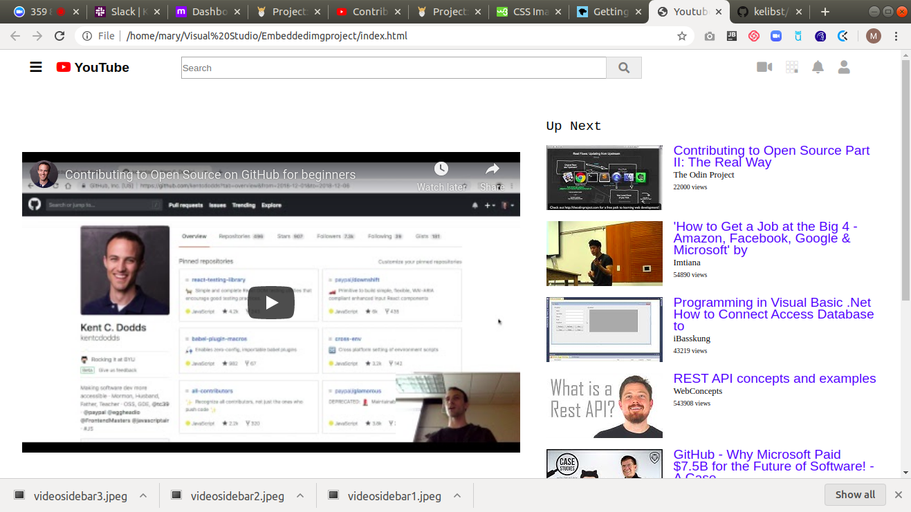

# Embeddedimgproject ([The Odin Project](https://www.theodinproject.com/courses/html5-and-css3/lessons/))

This is the first project of the Main HTML/CSS curriculum at [Microverse](https:www.microverse.org/) - @microverseinc

## Built With

- HTML5 
- CSS3

## Live Demo

[Live Demo Link](https://rawcdn.githack.com/kelibst/Embeddedimgproject/293f33787e8693704a0553b4bf027bb6cf296a99/index.html)

## Authors

👤 **Kelly Booster**

- Github: [@kelibst](https://github.com/kelibst)
- Twitter: [@keli_booster](https://twitter.com/keli_booster)
- Linkedin: [Kekeli (Jiresse) Dogbevi
](https://www.linkedin.com/in/kekeli-dogbevi-958272108/)

👤 **Marylene Sawyer**
- Github: [@Bluette1](https://github.com/Bluette1)
- Twitter: [@MaryleneSawyer](https://twitter.com/MaryleneSawyer)
- Linkedin: [Marylene Sawyer](https://www.linkedin.com/in/marylene-sawyer-b4ba1295/)

## 📝 License

This project is [MIT](https://opensource.org/licenses/MIT) licensed.

